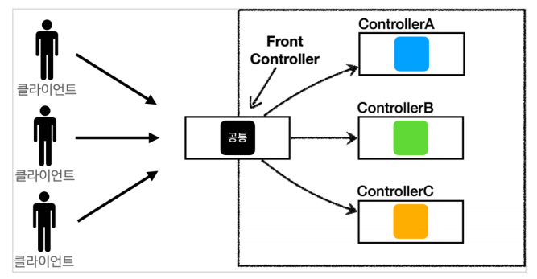

## frontController 패턴 특징

- 기존에는 각 클라이언트마다 요청하는 컨트롤러가 다르고 모두가 각 로직을 가졌다.
  - FRONT CONTROLLER를 통해 서블릿 하나로 로직을 몰아 관심사를 몰고 요청을 받음
- 특징
  - 서블릿 하나로 클라이언트의 요청을 받음
  - 프론트 컨트롤렁가 요청에 맞는 컨트롤러를 찾아 호출
  - 공통 처리 가능
  - 나머지 컨트롤러는 서블릿을 사용하지 않아도 됨
    - WAS서버에서 처음 요청을 받는것은 서블릿. 이 역할을 프론트 컨트롤러가 해준다.
  
## v1 컨트롤러
- 서블릿과 비슷한 모양의 컨트롤러 인터페이스를 구현
- 각 컨트롤러는 인터페이스를 구현
- 프론트 컨트롤러는 인터페이스 호출
- 로직의 일관성을 유지할 수 있다.
> 개선하고 싶은게 많아지더라도 구조를 개선할 때는 구조만 바꾸고 코드는 변경하지 않는다!

